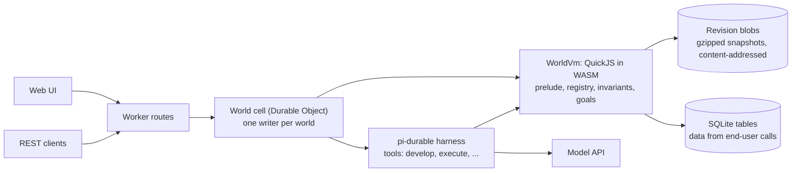
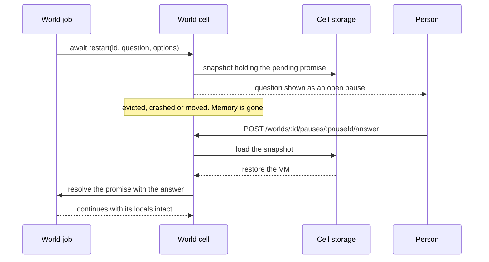

# pi-world

**A live application world that an agent grows by talking to it. The world is a snapshotable WASM heap, so every change is checked, versioned and reversible.**

> **Status: design plus verified spikes. There is no implementation yet.** Three spikes run against quickjs-wasi under
> Node. Nothing has run on celld. Sections below say *verified* (a spike shows it) or *designed* (a document says it).

---

## TL;DR

**The Problem.** An agent that builds an application by editing files has no safe way to try a change against the
running program. A bad edit breaks the live process, a restart loses in-memory state, and nothing says which change
broke what. The agent is also in the loop at runtime, though it is only needed to grow the program.

**The Solution.** The application is one QuickJS heap compiled to WASM
([`quickjs-wasi`](https://www.npmjs.com/package/quickjs-wasi)), driven by
[`@earendil-works/pi-durable`](https://github.com/earendil-works/pi/tree/main/packages/durable). The agent changes it
with `develop(source)`. Each attempt runs against an in-memory checkpoint; safety invariants decide whether it becomes
a new immutable revision or is restored. Accepted definitions are ordinary functions that people call over REST with
no model request. The target is [celld](https://celld.dev/) (self-hosted Durable Objects) with GCS buckets.

```text
develop(source)
  checkpoint = snapshot of the heap          # in memory, a few milliseconds
  evaluate source                            # synchronous, in a function scope, under an instruction budget
  if it made a host call, broke an invariant, or ran out of budget
    restore checkpoint
    return rejected, with the reason
  write the snapshot blob                    # gzipped, content-addressed, idempotent
  commit the revision manifest and the head pointer
  return accepted as revision N+1
```

It is the fastest implement-and-check loop for one kind of artifact: a program that grows through prompting, where the
result is validated and iterated on immediately. It is one station of a larger line, not the line.

### Why use it?

| Capability | What it means | Status |
|---|---|---|
| Checkpoint and restore | A failed attempt leaves no trace; snapshot and restore take a few milliseconds | verified |
| Deterministic snapshots | Same source on the same base gives byte-identical snapshots | verified |
| Live redefinition | A redefinition reaches captured references, callbacks, old instances and subclasses | verified |
| State that survives re-evaluation | `state(name, init, { version, migrate })` keeps its value across re-runs | verified |
| Runaway code stopped | An instruction budget interrupts a loop; the VM stays usable | verified |
| Pauses that survive crashes | `await restart(id, question, options)` is a pending promise in a stored snapshot | verified in a spike (survives snapshot, serialize, dispose, restore); the durable path is designed |
| Immutable revisions, rollback, cheap forks | Rollback creates a new revision; forks merge by replaying accepted `develop` sources | designed |
| Direct calls without a model | `POST /worlds/:id/call/:fn` | designed |

## The prelude

The prelude, installed at revision 0, is how `develop` sources are written. This is the designed form:

```js
const cache = state("lookup.cache", () => ({ hits: 0 }), { version: 1 });

define("lookup", (key) => {
	cache.hits += 1;
	return table[key];
});

// A later develop redefines lookup; every caller sees it, and cache.hits is kept.
```

A call always goes through a stub that is created once, so a reference captured before a redefinition still reaches
the newest implementation:

```text
lookup("a")                      # any caller, including one holding an old reference
  stub lookup                    # the global binding; never replaced
    registry["lookup"].impl      # swapped by each define
```

A redefinition changes one registry entry and nothing else:

```diff
 registry
-  lookup  →  (key) => table[key]
+  lookup  →  (key) => { cache.hits += 1; return table[key]; }
 globalThis.lookup                 # the same stub
 state "lookup.cache"              # kept: { hits: 41 }
```

A class that changes shape declares a version and a migration. Every live instance is migrated inside the attempt,
so a migration that throws rejects the `develop`:

```diff
 define("Point", class { ... }, { version: 2, migrate })
 live instance p
-  x: 3, y: 4              @1
+  rho: 5, theta: 0.927    @2
```

## Design philosophy

1. **The world is a live image.** Code and heap state live in one snapshotable VM. JavaScript is the world language;
   a compiled language would invalidate the snapshot at every `develop`.
2. **Attempts are transactions.** An attempt runs synchronously from checkpoint to accept or restore, so no direct call
   can observe an uncommitted heap.
3. **Definitions dispatch through a registry.** `define` never replaces a global binding. A stable stub calls the
   registry entry, and a class keeps one prototype patched in place, so a redefinition reaches every caller.
4. **Data is not heap.** Rows written by end-user calls live in SQLite through host functions. Heap instances stay few,
   which keeps eager migration at a class redefinition affordable.
5. **Only `develop` sources replay.** Merge and rebuild after a runtime upgrade replay accepted `develop` sources; a
   `develop` whose evaluation made host calls is rejected.
6. **Write blobs first, then commit the pointer.** A crash can leave an orphan blob, never a pointer to a missing one.

The full constraint list, each with the fact that forces it, is in [`design.md`](design.md).

## Comparison

| | pi-world | [jiti](https://github.com/ghuntley/jiti) |
|---|---|---|
| Medium | QuickJS heap in WASM, snapshotable | The style this project follows |
| Redefinition | Registry with stable stubs; instances migrate by declaration | jiti's README admits active frames can keep earlier definitions |
| Failed change | Restored from a checkpoint | |
| History | Immutable revisions; rollback is a new revision | |
| Runtime without a model | Direct REST calls to accepted definitions | |

The remaining hole in pi-world is a running frame: a job paused inside a function keeps that function's bytecode when
it resumes. `decisions.md` (open decision 8) records the choice still to make.

## Installation

There is nothing to install yet. The package is private and unpublished.

## Interfaces (designed, not built)

**Agent tools:** `develop`, `execute`, `preview`, `save_as`, `functions`, `describe`, `status`, `reset`, `history`,
`rollback`, `answer`, `abort`.

**REST API** (Worker routes forwarding to the world's cell):

| Route | Purpose |
|---|---|
| `POST /worlds` | Create a world |
| `POST /worlds/:id/fork` | Fork a world |
| `POST /worlds/:id/messages` | Submit to the agent; `requestId` makes retries idempotent |
| `POST /worlds/:id/call/:fn` | Call an accepted definition directly, no model |
| `POST /worlds/:id/pauses/:pauseId/answer` | Answer a pause; `requestId` makes retries idempotent |
| `GET /worlds/:id/revisions` | Revision history |
| `GET /worlds/:id/functions` | Catalogue |
| `POST /worlds/:id/rollback` | Roll back (creates a new revision) |

**Web UI:** a conversation view over a WebSocket, a world inspector (revisions, catalogue, failing goals, open pauses
with answer buttons) and a task graph panel. There is no TUI.

## Architecture (designed)



A direct call goes from the Worker to the cell to the VM and never reaches the harness or the model.

Revisions are stored as `WorldHead` and `WorldRevision` documents holding a manifest and a pointer to a blob.

## Measurements (verified, Node 25.2.1, synthetic definitions)

| Definitions | Raw snapshot | Gzipped |
|---|---|---|
| 0 | 1.38 MB | 109 KB |
| 200 | 1.64 MB | 176 KB |
| 2000 | 4.39 MB | 620 KB |

Growth is linear, about 1.5 KB per definition. Real worlds may differ.

## Limitations

- No implementation exists; the plan's milestone 1 (the `WorldVm`) is next.
- Nothing has run on celld, which is in beta. Its facts come from documentation pages. Open checks (memory and CPU per
  cell, blob size per row, pi-ai and pi-durable under celld's runtime, eviction timing, streaming lag) are in
  [`research.md`](research.md).
- A snapshot belongs to the exact `quickjs.wasm` build. After a runtime upgrade, the world is rebuilt by replaying the
  source log.
- Only instances built with `new` through a class are tracked and migrated.
- State values must be objects, not primitives.
- A running frame keeps the bytecode it started with.
- Each durable write takes about 90 ms, which shows as streaming lag.

## FAQ

**Does the agent run the application?** No. Accepted definitions are plain functions behind the REST call path. The
agent is needed to grow the application.

**Why JavaScript and not a compiled language?** Every `develop` would be a recompile into a module with a new memory
layout, which invalidates the previous snapshot. Compiled code is planned as a tier for stable, hot functions
(`plan.md`, milestone 9).

**What happens when a job is waiting for an answer and the node dies?** The pause is a pending promise in a stored
snapshot. It resumes on the new owner when the answer arrives. The kill-and-reopen test is milestone 4.



**Can the agent weaken its own checks?** As designed today, yes: invariants live in the world and are written through
`develop`. That is open decision 10 in [`decisions.md`](decisions.md).

**Where will it live, and how is the REST API authenticated?** Undecided. `decisions.md` lists these and the other
open decisions.

## Documents

| File | Content |
|---|---|
| [`intent.md`](intent.md) | What the system is, its position, interfaces |
| [`design.md`](design.md) | Constraints the implementation obeys |
| [`plan.md`](plan.md) | Milestones and where to stop for review |
| [`research.md`](research.md) | Spike results, celld facts, open checks, what is not verified |
| [`evaluation.md`](evaluation.md) | Review of the intent against its sources |
| [`decisions.md`](decisions.md) | Operator decisions, what they approve, open decisions |

## About Contributions

*About Contributions:* Please don't take this the wrong way, but I do not accept outside contributions for any of my projects. I simply don't have the mental bandwidth to review anything, and it's my name on the thing, so I'm responsible for any problems it causes; thus, the risk-reward is highly asymmetric from my perspective. I'd also have to worry about other "stakeholders," which seems unwise for tools I mostly make for myself for free. Feel free to submit issues, and even PRs if you want to illustrate a proposed fix, but know I won't merge them directly. Instead, I'll have Claude or Codex review submissions via `gh` and independently decide whether and how to address them. Bug reports in particular are welcome. Sorry if this offends, but I want to avoid wasted time and hurt feelings. I understand this isn't in sync with the prevailing open-source ethos that seeks community contributions, but it's the only way I can move at this velocity and keep my sanity.
