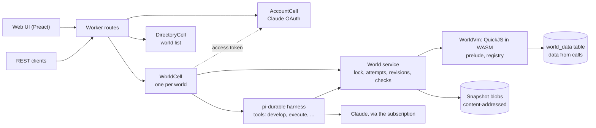
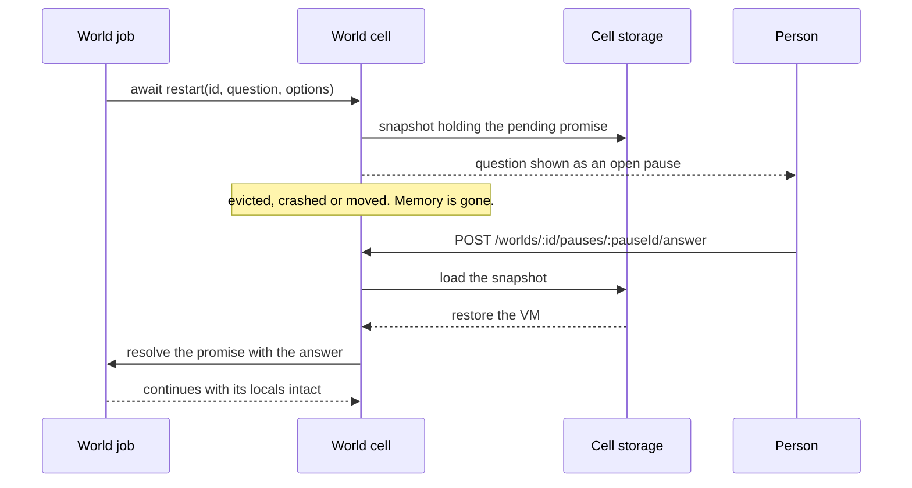

# pi-world

**A live application world that an agent grows by talking to it. The world is a snapshotable WASM heap, so every change is checked, versioned and reversible.**

> **Status: working prototype, deployed on one celld node.** The web UI, the agent, revisions, checks, direct calls and
> world pages run on celld at `http://oracle-arm.mist-walleye.ts.net:8787`. Pauses, forks and replay are still designs.
> Sections below say *built* (code and tests exist), *verified* (a spike shows it) or *designed* (a document says it).

---

## TL;DR

**The Problem.** An agent that builds an application by editing files has no safe way to try a change against the
running program. A bad edit breaks the live process, a restart loses in-memory state, and nothing says which change
broke what. The agent is also in the loop at runtime, though it is only needed to grow the program.

**The Solution.** The application is one QuickJS heap compiled to WASM
([`quickjs-wasi`](https://www.npmjs.com/package/quickjs-wasi)), driven by
[`@earendil-works/pi-durable`](https://github.com/earendil-works/pi/tree/main/packages/durable). The agent changes it
with `develop(source)`. Each attempt runs against an in-memory checkpoint; safety invariants decide whether it becomes
a new immutable revision or is restored. Accepted definitions are ordinary functions that people call over REST with
no model request. The target is [celld](https://celld.dev/) (self-hosted Durable Objects) with GCS buckets.

```text
develop(source)
  checkpoint = snapshot of the heap          # in memory, a few milliseconds
  evaluate source                            # synchronous, in a function scope, under an instruction budget
  if it made a host call, broke an invariant, or ran out of budget
    restore checkpoint
    return rejected, with the reason
  write the snapshot blob                    # gzipped, content-addressed, idempotent
  commit the revision manifest and the head pointer
  return accepted as revision N+1
```

It is the fastest implement-and-check loop for one kind of artifact: a program that grows through prompting, where the
result is validated and iterated on immediately. It is one station of a larger line, not the line.

### Why use it?

| Capability | What it means | Status |
|---|---|---|
| Checkpoint and restore | A failed attempt leaves no trace; snapshot and restore take a few milliseconds | built |
| Deterministic snapshots | Same source on the same base gives byte-identical snapshots | built |
| Live redefinition | A redefinition reaches captured references, callbacks, old instances and subclasses | built |
| State that survives re-evaluation | `state(name, init, { version, migrate })` keeps its value across re-runs | built |
| Runaway code stopped | A time budget interrupts a loop; the VM stays usable | built |
| Checks the agent cannot weaken | Enrolled only after failing on a counterexample; removed only by you, with a reason | built |
| Pages served by the world | `define("app", (path, query) => html)` is served at `/w/:id/` | built |
| Pauses that survive crashes | `await restart(id, question, options)` is a pending promise in a stored snapshot | verified in a spike (survives snapshot, serialize, dispose, restore); the durable path is designed |
| Immutable revisions and rollback | Rollback creates a new revision | built |
| Cheap forks | Forks merge by replaying accepted `develop` sources | designed |
| Direct calls without a model | `POST /api/worlds/:id/call/:fn` | built |

## The prelude

The prelude, installed at revision 0, is how `develop` sources are written. This is the designed form:

```js
const cache = state("lookup.cache", () => ({ hits: 0 }), { version: 1 });

define("lookup", (key) => {
	cache.hits += 1;
	return table[key];
});

// A later develop redefines lookup; every caller sees it, and cache.hits is kept.
```

A call always goes through a stub that is created once, so a reference captured before a redefinition still reaches
the newest implementation:

```text
lookup("a")                      # any caller, including one holding an old reference
  stub lookup                    # the global binding; never replaced
    registry["lookup"].impl      # swapped by each define
```

A redefinition changes one registry entry and nothing else:

```diff
 registry
-  lookup  →  (key) => table[key]
+  lookup  →  (key) => { cache.hits += 1; return table[key]; }
 globalThis.lookup                 # the same stub
 state "lookup.cache"              # kept: { hits: 41 }
```

A class that changes shape declares a version and a migration. Every live instance is migrated inside the attempt,
so a migration that throws rejects the `develop`:

```diff
 define("Point", class { ... }, { version: 2, migrate })
 live instance p
-  x: 3, y: 4              @1
+  rho: 5, theta: 0.927    @2
```

## A session, step by step (built)

This is the example session from jiti's README, as it runs in pi-world (`test/agent.test.ts` replays it with a
scripted model). You talk to the agent through the web UI or `POST /api/worlds/:id/messages`. The last two steps do not involve the agent or a model at all.

```text
you>  Add uppercaseString. Return an uppercased copy of the input.
you>  Add reverseString. Return a reversed copy without modifying the input.
you>  Uppercase "Hello", then reverse the result using those functions.
you>  Save that combination as shoutBackwards.
GET   /worlds/:id/functions
POST  /worlds/:id/call/shoutBackwards      {"args": ["Hello"]}
```

| Step | Who acts | What happens | Result |
|---|---|---|---|
| 1 | Agent calls `develop` | The source below is evaluated against a checkpoint. It makes no host call and the checks pass. | Accepted as revision 1 |
| 2 | Agent calls `develop` | Same path. JavaScript strings cannot be modified, so the input is safe by construction. | Accepted as revision 2 |
| 3 | Agent calls `execute` | Runs `reverseString(uppercaseString("Hello"))` in the world. Nothing in the world changes. | `"OLLEH"`, no revision |
| 4 | Agent calls `save_as` | Turns the expression from step 3 into a named definition, through the same attempt path as `develop`. | Accepted as revision 3 |
| 5 | You, no model | The catalogue lists `shoutBackwards` with its source and the revision that introduced it. The world inspector in the web UI shows the same. | A catalogue entry |
| 6 | You, no model | The cell calls the accepted function directly, under the same instruction budget. | `"OLLEH"`, no revision |

The sources the agent writes in steps 1, 2 and 4:

```js
define("uppercaseString", (s) => s.toUpperCase());

define("reverseString", (s) => [...s].reverse().join(""));

define("shoutBackwards", (s) => reverseString(uppercaseString(s)));
```

What differs from jiti:

- **Names.** jiti's `uppercase-string` becomes `uppercaseString`, because a definition is a JavaScript global.
- **Slash commands.** jiti's `/describe` and `/execute` are terminal commands. Here they are a `GET` of the catalogue and
  a direct `POST` call. The body shape of the call is not fixed yet.
- **A failed step.** If a `develop` breaks a check, makes a host call or runs out of budget, the checkpoint is
  restored and the agent gets the reason. The world stays at the last accepted revision.
- **Later changes.** `shoutBackwards` calls the other two through their stubs. If you later ask for a different
  `reverseString`, `shoutBackwards` uses the new one without being touched.

## Design philosophy

1. **The world is a live image.** Code and heap state live in one snapshotable VM. JavaScript is the world language;
   a compiled language would invalidate the snapshot at every `develop`.
2. **Attempts are transactions.** An attempt runs synchronously from checkpoint to accept or restore, so no direct call
   can observe an uncommitted heap.
3. **Definitions dispatch through a registry.** `define` never replaces a global binding. A stable stub calls the
   registry entry, and a class keeps one prototype patched in place, so a redefinition reaches every caller.
4. **Data is not heap.** Rows written by end-user calls live in SQLite through host functions. Heap instances stay few,
   which keeps eager migration at a class redefinition affordable.
5. **Only `develop` sources replay.** Merge and rebuild after a runtime upgrade replay accepted `develop` sources; a
   `develop` whose evaluation made host calls is rejected.
6. **Write blobs first, then commit the pointer.** A crash can leave an orphan blob, never a pointer to a missing one.

The full constraint list, each with the fact that forces it, is in [`design.md`](design.md).

## Comparison

| | pi-world | [jiti](https://github.com/ghuntley/jiti) |
|---|---|---|
| Medium | QuickJS heap in WASM, snapshotable | The style this project follows |
| Redefinition | Registry with stable stubs; instances migrate by declaration | jiti's README admits active frames can keep earlier definitions |
| Failed change | Restored from a checkpoint | |
| History | Immutable revisions; rollback is a new revision | |
| Runtime without a model | Direct REST calls to accepted definitions | |

The remaining hole in pi-world is a running frame: a job paused inside a function keeps that function's bytecode when
it resumes. `decisions.md` (open decision 8) records the choice still to make.

## Use it

Open `http://oracle-arm.mist-walleye.ts.net:8787` from a machine on the tailnet.

1. **Log in with Claude** (bottom left). This uses your Pro/Max subscription the way pi does: a tab opens on
   claude.ai, you approve, and you paste the code Anthropic shows back into the box. Or run `claude setup-token` and
   paste the token it prints.
2. **Create a world** (top left) and ask for something: *"Keep a todo list: add, toggle, delete, list. Then make an
   app page for it."*
3. Watch the agent's `develop` and `execute` calls in the chat. Each accepted `develop` is a revision; a rejected one
   shows its reason and changes nothing.
4. The **inspector** on the right has:
   - **Functions:** call any definition with arguments, no model involved.
   - **Revisions:** each change with its source; roll back to any revision.
   - **Data:** what calls stored.
   - **Checks:** what every future change must keep true.
   - **Console:** evaluate expressions, or develop a source by hand.
   - **App:** the world's page.
5. **Open app** opens the page the world serves at `/w/:id/`.

## Develop it

```sh
npm install
npm test            # vitest: the VM, attempts, the World service, the agent with a scripted model
npm run typecheck
npm run dev         # builds the UI and runs `celld dev` on 127.0.0.1:8791
npm run deploy      # typecheck, test, build, then `celld deploy` to gs://pi-world-celld
```

`npm run deploy` reads the fleet's service-account key from `~/.config/celld/pi-world.json`; set
`GOOGLE_APPLICATION_CREDENTIALS` and `CELLD_BUCKET` to deploy elsewhere. A running node adopts a new deployment
without a restart. Keep the Worker `name` (`pi-world`) stable: celld derives every cell id from it.

## Interfaces (built)

**Agent tools:** `develop`, `execute`, `describe`, `history`, `rollback`, `propose_check`. The system prompt's `world`
section lists the revision, the definitions with their docs, and the checks. Designed but not built: `preview`,
`answer`, pauses.

**REST API:**

| Route | Purpose |
|---|---|
| `GET /api/worlds`, `POST /api/worlds {name}` | List worlds, create one |
| `GET /api/worlds/:id` | Summary: revision, functions with source, checks, model |
| `GET /api/worlds/:id/ws` | WebSocket: `world` and `transcript` frames |
| `POST /api/worlds/:id/messages {content, requestId}` | Submit to the agent; `requestId` makes a retry a no-op |
| `POST /api/worlds/:id/abort`, `POST /api/worlds/:id/reset` | Stop the run; start a new context |
| `POST /api/worlds/:id/call/:fn {args}` | Call a definition directly, no model |
| `POST /api/worlds/:id/execute {expression}` | Evaluate an expression against the world |
| `POST /api/worlds/:id/develop {source, summary}` | Develop by hand, through the same attempt |
| `GET /api/worlds/:id/revisions[/:n]`, `POST /api/worlds/:id/rollback {revision, reason}` | History and rollback |
| `GET /api/worlds/:id/checks`, `DELETE /api/worlds/:id/checks/:name {reason}` | Checks; removal needs a reason |
| `GET /api/worlds/:id/data?prefix=`, `DELETE /api/worlds/:id/data/:key` | The world's data |
| `POST /api/worlds/:id/model {model}` | Choose the Claude model |
| `GET /api/account`, `POST /api/account/login`, `POST /api/account/login/finish {code}`, `POST /api/account/token {token}`, `POST /api/account/logout` | Claude login |
| `GET /w/:id/*` | The world's page |

There is no authentication: anyone on the tailnet can call every route.

## Architecture (built)



A direct call goes from the Worker to the cell to the VM and never reaches the harness or the model. Every operation
on a world holds its lock, and after a call the VM returns to the head snapshot.

| Directory | What it does |
|---|---|
| `src/world/` | `WorldVm`, the prelude, attempts, the `World` service |
| `src/revision/` | Revision manifests, the head, the blob store port, the pi-durable documents |
| `src/check/` | The check type |
| `src/agent/` | The agent's tools, its standing instructions and the `world` section |
| `src/conversation/` | The transcript the UI shows |
| `src/cell/` | The world cell: SQLite adapter, routes, WebSocket fan-out, world pages |
| `src/account/`, `src/directory/` | The Claude credential, the world list |
| `src/api/` | The wire contract shared with the UI |
| `ui/` | The web UI |

Revisions are stored as `world.head` and `world.revision` documents holding a manifest and a pointer to a blob.

## Measurements (verified, Node 25.2.1, synthetic definitions)

| Definitions | Raw snapshot | Gzipped |
|---|---|---|
| 0 | 1.38 MB | 109 KB |
| 200 | 1.64 MB | 176 KB |
| 2000 | 4.39 MB | 620 KB |

Growth is linear, about 1.5 KB per definition. Real worlds may differ.

## Limitations

- A prototype: no authentication, one node, no pauses, forks or replay. The defaults chosen for open questions are
  listed in [`decisions.md`](decisions.md) under "Prototype assumptions".
- celld is in beta. Open checks that remain (memory and CPU per cell, eviction timing, streaming lag) are in
  [`research.md`](research.md).
- Checks cannot read data, so a behaviour that depends on stored data is hard to protect with one.
- `execute` keeps its data writes, so an agent that tries its functions can leave test rows behind, or delete yours.
- A snapshot belongs to the exact `quickjs.wasm` build. After a runtime upgrade, the world is rebuilt by replaying the
  source log.
- Only instances built with `new` through a class are tracked and migrated.
- State values must be objects, not primitives.
- A running frame keeps the bytecode it started with.
- Each durable write waits for the bucket on a single node; progress commits are spaced 400 ms apart.

## FAQ

**Does the agent run the application?** No. Accepted definitions are plain functions behind the REST call path. The
agent is needed to grow the application.

**Why JavaScript and not a compiled language?** Every `develop` would be a recompile into a module with a new memory
layout, which invalidates the previous snapshot. Compiled code is planned as a tier for stable, hot functions
(`plan.md`, milestone 9).

**What happens when a job is waiting for an answer and the node dies?** The pause is a pending promise in a stored
snapshot. It resumes on the new owner when the answer arrives. The kill-and-reopen test is milestone 4.



**Can the agent weaken its own checks?** No. Checks are stored on the host side, outside the heap, and world code has
no way to reach them. The agent can propose a check, and it is enrolled only after it has been seen failing on a
counterexample. Removing or loosening one is an operator call with a reason. The built-ins a check calls are frozen.
One case is still open: a check that calls a function the agent defined, which is open decision 13 in
[`decisions.md`](decisions.md).

**Where will it live, and how is the REST API authenticated?** Undecided. `decisions.md` lists these and the other
open decisions.

## Documents

| File | Content |
|---|---|
| [`intent.md`](intent.md) | What the system is, its position, interfaces |
| [`design.md`](design.md) | Constraints the implementation obeys |
| [`plan.md`](plan.md) | Milestones and where to stop for review |
| [`research.md`](research.md) | Spike results, celld facts, open checks, what is not verified |
| [`evaluation.md`](evaluation.md) | Review of the intent against its sources |
| [`decisions.md`](decisions.md) | Operator decisions, what they approve, open decisions |

## About Contributions

*About Contributions:* Please don't take this the wrong way, but I do not accept outside contributions for any of my projects. I simply don't have the mental bandwidth to review anything, and it's my name on the thing, so I'm responsible for any problems it causes; thus, the risk-reward is highly asymmetric from my perspective. I'd also have to worry about other "stakeholders," which seems unwise for tools I mostly make for myself for free. Feel free to submit issues, and even PRs if you want to illustrate a proposed fix, but know I won't merge them directly. Instead, I'll have Claude or Codex review submissions via `gh` and independently decide whether and how to address them. Bug reports in particular are welcome. Sorry if this offends, but I want to avoid wasted time and hurt feelings. I understand this isn't in sync with the prevailing open-source ethos that seeks community contributions, but it's the only way I can move at this velocity and keep my sanity.
