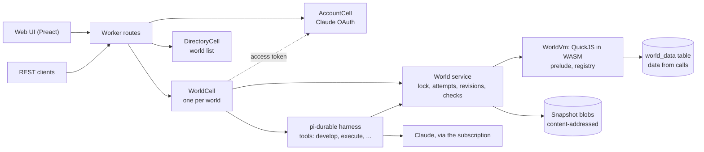
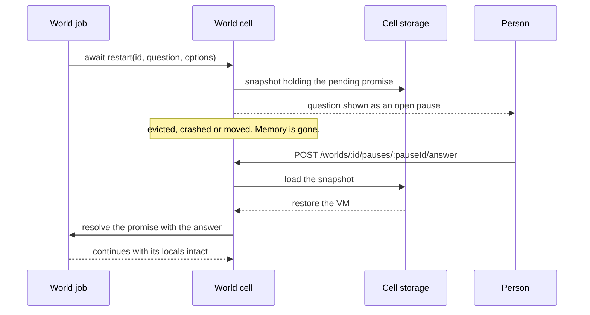

# pi-world

**A live application world that an agent grows by talking to it. The world is a snapshotable WASM heap, so every change is checked, versioned and reversible.**

> **Status: working prototype, running on one celld node** at `http://oracle-arm.mist-walleye.ts.net:8787`. The web UI,
> the agent on a Claude subscription, revisions, checks, direct calls and world pages work there. Pauses, forks and
> replay are still designs. Sections below say *on the node* (seen working on the deployed node), *built* (code and
> tests exist), *spike* (a spike shows it) or *designed* (a document says it).

---

## TL;DR

**The Problem.** An agent that builds an application by editing files has no safe way to try a change against the
running program. A bad edit breaks the live process, a restart loses in-memory state, and nothing says which change
broke what. The agent is also in the loop at runtime, though it is only needed to grow the program.

**The Solution.** The application is one QuickJS heap compiled to WASM
([`quickjs-wasi`](https://www.npmjs.com/package/quickjs-wasi)), driven by
[`@earendil-works/pi-durable`](https://github.com/earendil-works/pi/tree/main/packages/durable). The agent changes it
with `develop(source)`. Each attempt runs against an in-memory checkpoint; safety invariants decide whether it becomes
a new immutable revision or is restored. Accepted definitions are ordinary functions that people call over REST with
no model request. The target is [celld](https://celld.dev/) (self-hosted Durable Objects) with GCS buckets.

```text
develop(source)
  checkpoint = snapshot of the heap          # in memory, a few milliseconds
  evaluate source                            # synchronous, in a function scope, under a time budget
  if it threw, touched data, broke a check, or ran out of budget
    restore checkpoint
    return rejected, with the reason
  write the snapshot blob                    # content-addressed, idempotent
  commit the revision manifest and the head pointer
  return accepted as revision N+1
```

It is the fastest implement-and-check loop for one kind of artifact: a program that grows through prompting, where the
result is validated and iterated on immediately. It is one station of a larger line, not the line.

### Why use it?

| Capability | What it means | Status |
|---|---|---|
| Grow an app by talking | The agent writes `develop` sources; each accepted one is a revision | on the node |
| Checkpoint and restore | A failed attempt leaves no trace; snapshot and restore take a few milliseconds | on the node |
| Direct calls without a model | `POST /api/worlds/:id/call/:fn` runs the function in the cell, 62 to 71 ms over the tailnet | on the node |
| Worlds calling worlds | `await worlds.call(id, name, ...args)` uses another world's service; cycles are refused | on the node |
| Pages served by the world | `define("app", (path, query) => html)` is served at `/w/:id/` | on the node |
| Checks the agent cannot weaken | Enrolled only after failing on a counterexample; removed only by you, with a reason | on the node |
| Immutable revisions and rollback | Rollback creates a new revision | on the node |
| Runs that survive a crash | A run interrupted by a celld restart continues and finishes, with no revision accepted twice | on the node |
| Claude through your subscription | OAuth as pi does it, or a `claude setup-token` token, checked with Anthropic before it is saved | on the node |
| Deterministic snapshots | Same source on the same base gives byte-identical snapshots | built |
| Live redefinition | A redefinition reaches captured references, callbacks, old instances and subclasses | built |
| State that survives re-evaluation | `state(name, init, { version, migrate })` keeps its value across re-runs | built |
| Runaway code stopped | A time budget interrupts a loop; the VM stays usable | built |
| Pauses that survive crashes | `await restart(id, question, options)` is a pending promise in a stored snapshot | spike; the durable path is designed |
| Cheap forks | Forks merge by replaying accepted `develop` sources | designed |

## The prelude

The prelude, installed at revision 0, is how `develop` sources are written:

| Function | What it does |
|---|---|
| `define(name, impl, { doc, version, migrate })` | Add or replace a global function or class; every caller reaches the newest impl |
| `undefine(name)` | Remove a definition |
| `state(name, init, { version, migrate })` | A heap object that `init` creates once and later evaluations keep |
| `data.get / set / delete / list(prefix)` | The world's persistent key-value store, JSON values; for calls only, never a `develop` |
| `worlds.list() / functions(id) / call(id, name, ...args)` | The other worlds on the server; promises, for calls only. See [Calls between worlds](#calls-between-worlds-built) |

A world built before a prelude change is brought up to date by an `upgrade` revision when it next opens.

```js
const cache = state("lookup.cache", () => ({ hits: 0 }), { version: 1 });

define("lookup", (key) => {
	cache.hits += 1;
	return table[key];
});

// A later develop redefines lookup; every caller sees it, and cache.hits is kept.
```

A call always goes through a stub that is created once, so a reference captured before a redefinition still reaches
the newest implementation:

```text
lookup("a")                      # any caller, including one holding an old reference
  stub lookup                    # the global binding; never replaced
    registry["lookup"].impl      # swapped by each define
```

A redefinition changes one registry entry and nothing else:

```diff
 registry
-  lookup  →  (key) => table[key]
+  lookup  →  (key) => { cache.hits += 1; return table[key]; }
 globalThis.lookup                 # the same stub
 state "lookup.cache"              # kept: { hits: 41 }
```

A class that changes shape declares a version and a migration. Every live instance is migrated inside the attempt,
so a migration that throws rejects the `develop`:

```diff
 define("Point", class { ... }, { version: 2, migrate })
 live instance p
-  x: 3, y: 4              @1
+  rho: 5, theta: 0.927    @2
```

## Calls between worlds (built)

Every world's definitions are a service to every other world on the server. World code calls one with
`await worlds.call(worldId, name, ...args)`; `worlds.list()` and `worlds.functions(worldId)` say what exists. This
is an asynchronous request and response between two cells: the caller awaits a promise, the other world runs the
function in its own cell and VM, and the result or the error comes back. No model is involved at any point.

### How a call travels

```mermaid
sequenceDiagram
    participant Caller as Caller world code
    participant A as Caller cell (holds its lock)
    participant B as Callee cell
    participant VM as Callee world code
    Caller->>A: await worlds.call("b", "convert", 40500, "JPY", "USD")
    Note over A: the evaluation step ends; the promise is pending
    A->>B: peerCall("convert", args, chain = [a]) over Durable Object RPC
    B->>VM: call convert under the callee's lock
    VM-->>B: 270, or a thrown error
    B-->>A: { ok, value } or { ok: false, error }
    A->>Caller: resolve (or reject) the promise, run the waiting code
```

- **It is asynchronous for the code.** `worlds.call` returns a promise, so a function that uses it is `async`. Calls
  awaited together run at the same time: two 200 ms calls under `Promise.all` take about 200 ms
  (`test/peers.test.ts`).
- **The calling world is busy while it waits.** Its cell holds the world's lock for the whole call, because the VM is
  in the middle of an evaluation. Other calls and develops on that world queue behind it; the cell's conversation and
  sockets keep working. The called world is locked only while its function runs.
- **Errors cross over as rejections.** A throw in the other world rejects the promise with an `Error` whose message
  names where it came from, hop by hop.
- **Cycles are refused.** A call carries the chain of worlds it has passed through. A call back into a world already
  on the chain would wait for a lock the chain holds, so it is refused at once; a chain is at most four worlds.
- **Only calls reach other worlds.** A `develop` or a check that touches `worlds` is rejected, as with `data`.

### Use cases

**A shared service.** One world owns a capability and others use it rather than copying it. The agent built a
*Currency* world, then a *Trip budget* world that found it with `worlds.list()` and `worlds.functions(id)`:

```js
// Currency (currency-edcacf)
define("convert", (amount, from, to) => { /* fixed rates kept in state */ }, { doc: "Convert between USD, JPY, EUR and CAD." });

// Trip budget (trip-budget-3a39bb)
define("totals", async (currency) => {
	const totalYen = listExpenses().reduce((s, e) => s + e.yen, 0);
	const converted = await worlds.call("currency-edcacf", "convert", totalYen, "JPY", currency);
	return { yen: totalYen, currency, converted };
});
```

`POST /api/worlds/trip-budget-3a39bb/call/totals {"args": ["USD"]}` answers
`{"yen": 40500, "currency": "USD", "converted": 270}` in about 60 ms.

**A view over several worlds, asked in parallel.** A *Dashboard* world reads two worlds at once; one of them calls
a third:

```js
// Dashboard (dashboard-485394)
define("overview", async (currency = "USD") => {
	const [todos, trip] = await Promise.all([
		worlds.call("demo-todos-031d08", "stats"),
		worlds.call("trip-budget-3a39bb", "totals", currency),
	]);
	return { openTodos: todos.open, tripSpent: trip.converted, currency };
}, { doc: "Todos and trip spending from two other worlds, asked in parallel." });
```

`overview("EUR")` answers `{"openTodos": 2, "tripSpent": 248.4, "currency": "EUR"}` in 70 to 100 ms on the node,
across four worlds: Dashboard, Demo todos, Trip budget and Currency.

**Handling another world's failure.** A caller decides what a failure means for it:

```js
define("tripIn", async (currency) => {
	try {
		return await worlds.call("trip-budget-3a39bb", "totals", currency);
	} catch (error) {
		return { error: error.message };
	}
});
```

`tripIn("GBP")` answers `{"error": "trip-budget-3a39bb.totals: Error: currency-edcacf.convert: Error: Unknown
currency: GBP"}`: the message carries the path the error took.

**Discovery.** The agent finds services the same way world code does, with `execute`:
`worlds.list()` gives `[{ id, name }]`, and `worlds.functions(id)` gives each definition's name, kind, doc and
parameters.

### What it is not, yet

A call is a query or a command that needs its answer now. It is not durable messaging: there is no queue, retry or
idempotency key, a caller that crashes mid-call loses the call while data the other world wrote stays, and a world that
does not answer within 30 s fails the call. Any world may call any other; there are no permissions. Which semantics
calls between worlds should have (RPC under the lock, RPC without it, durable messages through celld Queues, or
both) is open decision 14 in [`decisions.md`](decisions.md), with the trade-offs and the questions to research.

## A session, step by step (built)

This is the example session from jiti's README, as it runs in pi-world (`test/agent.test.ts` replays it with a
scripted model). You talk to the agent through the web UI or `POST /api/worlds/:id/messages`.
The last two steps do not involve the agent or a model at all.

```text
you>  Add uppercaseString. Return an uppercased copy of the input.
you>  Add reverseString. Return a reversed copy without modifying the input.
you>  Uppercase "Hello", then reverse the result using those functions.
you>  Save that combination as shoutBackwards.
GET   /api/worlds/:id/functions
POST  /api/worlds/:id/call/shoutBackwards      {"args": ["Hello"]}
```

| Step | Who acts | What happens | Result |
|---|---|---|---|
| 1 | Agent calls `develop` | The source below is evaluated against a checkpoint. It touches no data and the checks pass. | Accepted as revision 1 |
| 2 | Agent calls `develop` | Same path. JavaScript strings cannot be modified, so the input is safe by construction. | Accepted as revision 2 |
| 3 | Agent calls `execute` | Runs `reverseString(uppercaseString("Hello"))` in the world. Nothing in the world changes. | `"OLLEH"`, no revision |
| 4 | Agent calls `develop` | Defines the combination from step 3 as a named function. | Accepted as revision 3 |
| 5 | You, no model | The catalogue lists `shoutBackwards` with its source and the revision that introduced it. The world inspector in the web UI shows the same. | A catalogue entry |
| 6 | You, no model | The cell calls the accepted function directly, under the same time budget. | `"OLLEH"`, no revision |

The sources the agent writes in steps 1, 2 and 4:

```js
define("uppercaseString", (s) => s.toUpperCase());

define("reverseString", (s) => [...s].reverse().join(""));

define("shoutBackwards", (s) => reverseString(uppercaseString(s)));
```

What differs from jiti:

- **Names.** jiti's `uppercase-string` becomes `uppercaseString`, because a definition is a JavaScript global.
- **Slash commands.** jiti's `/describe` and `/execute` are terminal commands. Here they are a `GET` of the catalogue and
  a direct `POST` call with `{"args": [...]}`.
- **A failed step.** If a `develop` throws, touches data, breaks a check or runs out of budget, the checkpoint is
  restored and the agent gets the reason. The world stays at the last accepted revision.
- **Later changes.** `shoutBackwards` calls the other two through their stubs. If you later ask for a different
  `reverseString`, `shoutBackwards` uses the new one without being touched.

## Design philosophy

1. **The world is a live image.** Code and heap state live in one snapshotable VM. JavaScript is the world language;
   a compiled language would invalidate the snapshot at every `develop`.
2. **Attempts are transactions.** An attempt runs synchronously from checkpoint to accept or restore, so no direct call
   can observe an uncommitted heap.
3. **Definitions dispatch through a registry.** `define` never replaces a global binding. A stable stub calls the
   registry entry, and a class keeps one prototype patched in place, so a redefinition reaches every caller.
4. **Data is not heap.** What calls store goes through `data` into the cell's SQLite. A call's heap changes are
   discarded, so only revisions change the heap. Heap instances stay few, which keeps eager migration affordable.
5. **Only `develop` sources replay.** Merge and rebuild after a runtime upgrade replay accepted `develop` sources; a
   `develop` that touches data is rejected.
6. **Write blobs first, then commit the pointer.** A crash can leave an orphan blob, never a pointer to a missing one.

The full constraint list, each with the fact that forces it, is in [`design.md`](design.md).

## Comparison

| | pi-world | [jiti](https://github.com/ghuntley/jiti) |
|---|---|---|
| Medium | QuickJS heap in WASM, snapshotable | The style this project follows |
| Redefinition | Registry with stable stubs; instances migrate by declaration | jiti's README admits active frames can keep earlier definitions |
| Failed change | Restored from a checkpoint | |
| History | Immutable revisions; rollback is a new revision | |
| Runtime without a model | Direct REST calls to accepted definitions | |

The remaining hole in pi-world is a running frame: a job paused inside a function keeps that function's bytecode when
it resumes. `decisions.md` (open decision 8) records the choice still to make.

## Use it

Open `http://oracle-arm.mist-walleye.ts.net:8787` from a machine on the tailnet.

1. **Connect Claude** (the button in the sidebar or on the welcome page). This uses your Pro/Max subscription the way
   pi does. Either tap **Open claude.ai**, approve, and paste the code Anthropic shows; or run `claude setup-token` on
   a computer with Claude Code and paste the token, which is checked with Anthropic before it is saved. One login
   serves every world on the server.
2. **Create a world** (top of the sidebar) and ask for something: *"Keep a todo list: add, toggle, delete, list. Then make an
   app page for it."*
3. Watch the agent's `develop` and `execute` calls in the chat. Each accepted `develop` is a revision; a rejected one
   shows its reason and changes nothing.
4. The **inspector** on the right has:
   - **Functions:** call any definition with arguments, no model involved.
   - **Revisions:** each change with its source; roll back to any revision.
   - **Data:** what calls stored.
   - **Checks:** what every future change must keep true.
   - **Console:** evaluate expressions, or develop a source by hand.
   - **App:** the world's page.
5. **Open app** opens the page the world serves at `/w/:id/`.

The UI works on a phone: the chat and the inspector switch with the Chat and Inspect buttons.

## Develop it

```sh
npm install
npm test            # vitest: the VM, attempts, the World service, the agent with a scripted model
npm run typecheck
npm run dev         # builds the UI and runs `celld dev` on 127.0.0.1:8791 (restart it after a UI change)
npm run deploy      # typecheck, test, build, then `celld deploy` to gs://pi-world-celld
```

`npm run deploy` reads the fleet's service-account key from `~/.config/celld/pi-world.json`; set
`GOOGLE_APPLICATION_CREDENTIALS` and `CELLD_BUCKET` to deploy elsewhere. A running node adopts a new deployment
without a restart. Keep the Worker `name` (`pi-world`) stable: celld derives every cell id from it.

## Interfaces (built)

**Agent tools:** `develop`, `execute`, `describe`, `history`, `rollback`, `propose_check`. The system prompt's `world`
section lists the revision, the definitions with their docs, and the checks. Designed but not built: `preview`,
`answer`, pauses.

**REST API:**

| Route | Purpose |
|---|---|
| `GET /api/worlds`, `POST /api/worlds {name}` | List worlds, create one |
| `GET /api/worlds/:id` | Summary: revision, functions with source, checks, model |
| `GET /api/worlds/:id/ws` | WebSocket: `world` and `transcript` frames |
| `POST /api/worlds/:id/messages {content, requestId}` | Submit to the agent; `requestId` makes a retry a no-op |
| `POST /api/worlds/:id/abort`, `POST /api/worlds/:id/reset` | Stop the run; start a new context |
| `POST /api/worlds/:id/call/:fn {args}` | Call a definition directly, no model; world code reaches other worlds with `worlds.call` |
| `POST /api/worlds/:id/execute {expression}` | Evaluate an expression against the world |
| `POST /api/worlds/:id/develop {source, summary}` | Develop by hand, through the same attempt |
| `GET /api/worlds/:id/revisions[/:n]`, `POST /api/worlds/:id/rollback {revision, reason}` | History and rollback |
| `GET /api/worlds/:id/checks`, `DELETE /api/worlds/:id/checks/:name {reason}` | Checks; removal needs a reason |
| `GET /api/worlds/:id/data?prefix=`, `DELETE /api/worlds/:id/data/:key` | The world's data |
| `POST /api/worlds/:id/model {model}` | Choose the Claude model |
| `GET /api/account`, `POST /api/account/login`, `POST /api/account/login/finish {code}`, `POST /api/account/token {token}`, `POST /api/account/logout` | Claude login |
| `GET /w/:id/*` | The world's page |

There is no authentication: anyone on the tailnet can call every route.

## Architecture (built)



A direct call goes from the Worker to the cell to the VM and never reaches the harness or the model. Every operation
on a world holds its lock, and after a call the VM returns to the head snapshot.

| Directory | What it does |
|---|---|
| `src/world/` | `WorldVm`, the prelude, attempts, the `World` service |
| `src/revision/` | Revision manifests, the head, the blob store port, the pi-durable documents |
| `src/check/` | The check type |
| `src/agent/` | The agent's tools, its standing instructions and the `world` section |
| `src/conversation/` | The transcript the UI shows |
| `src/cell/` | The world cell: SQLite adapter, routes, WebSocket fan-out, world pages |
| `src/account/`, `src/directory/` | The Claude credential, the world list |
| `src/api/` | The wire contract shared with the UI |
| `ui/` | The web UI |

Revisions are stored as `world.head` and `world.revision` documents holding a manifest and a pointer to a blob.

## Verified on the node

Each line was seen on the deployed node (celld 0.6.1, one aarch64 node, GCS bucket) unless it says otherwise. Details
are in [`research.md`](research.md).

| What | Evidence |
|---|---|
| The stack runs in a cell | quickjs-wasi, pi-durable over the cell's SQLite, and pi-ai's Anthropic provider; one answered input in about 1 s |
| Login | The copy-code OAuth login, completed by a person from a phone; a fake pasted token is refused with 400 |
| An agent session | A todo app with seven functions, a check and a page, built through the UI; a todo added on the page read back by a direct call |
| Direct calls need no model | 62 to 71 ms per call, conversation unchanged; on a `celld dev` with no credential, calls work while agent messages fail |
| A crash mid-run | celld restarted between tool rounds with nothing sent afterwards; the run finished, no revision accepted twice |
| Worlds calling worlds | Trip budget's `totals` calls Currency's `convert` over Durable Object RPC: 270 USD for ¥40,500, the same as calling Currency directly |
| Fan-out across worlds | Dashboard's `overview` asks Demo todos and Trip budget in parallel, and Trip budget asks Currency: 70 to 100 ms across four worlds |
| Prelude upgrade | Demo todos, built on prelude 1, opened on the new version and got revision 6, "prelude 1 to 2" |
| Snapshot rows | A 1.44 MB snapshot round-trips through the cell's SQLite |

The test suite (`npm test`, 47 tests) covers the VM, attempts, the `World` service, the agent with a scripted model,
that a direct call makes no model request, calls between worlds (results, errors, cycles, discovery), and the
upgrade of a heap built by an older prelude. There are no property-based tests, Gherkin scenarios or mutation runs
yet.

## Measurements (Node 25.2.1, synthetic definitions)

| Definitions | Raw snapshot | Gzipped |
|---|---|---|
| 0 | 1.38 MB | 109 KB |
| 200 | 1.64 MB | 176 KB |
| 2000 | 4.39 MB | 620 KB |

Growth is linear, about 1.5 KB per definition. Snapshots are stored raw in the prototype. Real worlds may differ.

## Limitations

- A prototype: no authentication, one node, no pauses, forks or replay. The defaults chosen for open questions are
  listed in [`decisions.md`](decisions.md) under "Prototype assumptions".
- celld is in beta. Open checks that remain (memory and CPU per cell, what wakes a cell after a restart, a run moving
  to another node, the OAuth refresh at expiry, streaming lag) are in [`research.md`](research.md).
- Checks cannot read data, so a behaviour that depends on stored data is hard to protect with one.
- `execute` keeps its data writes, so an agent that tries its functions can leave test rows behind, or delete yours.
- A snapshot belongs to the exact `quickjs.wasm` build. After a runtime upgrade, the world is rebuilt by replaying the
  source log.
- Only instances built with `new` through a class are tracked and migrated.
- State values must be objects, not primitives.
- A running frame keeps the bytecode it started with.
- Each durable write waits for the bucket on a single node; progress commits are spaced 400 ms apart.

## FAQ

**Does the agent run the application?** No. Accepted definitions are plain functions behind the REST call path. The
agent is needed to grow the application.

**Why JavaScript and not a compiled language?** Every `develop` would be a recompile into a module with a new memory
layout, which invalidates the previous snapshot. Compiled code is planned as a tier for stable, hot functions
(`plan.md`, milestone 9).

**What happens to an agent run when the node dies?** It continues from its last committed step when the cell comes
back; this was seen on the node.

**What happens when a job is waiting for an answer and the node dies?** Designed, not built: the pause is a pending
promise in a stored snapshot, and it resumes on the new owner when the answer arrives. The kill-and-reopen test is
milestone 4.



**Can the agent weaken its own checks?** No. Checks are stored on the host side, outside the heap, and world code has
no way to reach them. The agent can propose a check, and it is enrolled only after it has been seen failing on a
counterexample. Removing or loosening one is an operator call with a reason. The built-ins a check calls are frozen.
One case is still open: a check that calls a function the agent defined, which is open decision 13 in
[`decisions.md`](decisions.md).

**How is the REST API authenticated?** In the prototype it is not: the node is reachable only on the tailnet. The real
answer, and where the package lives, are open decisions in `decisions.md`.

## Documents

| File | Content |
|---|---|
| [`intent.md`](intent.md) | What the system is, its position, interfaces |
| [`design.md`](design.md) | Constraints the implementation obeys |
| [`plan.md`](plan.md) | Milestones and where to stop for review |
| [`research.md`](research.md) | Spike results, celld facts, open checks, what is not verified |
| [`evaluation.md`](evaluation.md) | Review of the intent against its sources |
| [`decisions.md`](decisions.md) | Operator decisions, what they approve, open decisions |

## About Contributions

*About Contributions:* Please don't take this the wrong way, but I do not accept outside contributions for any of my projects. I simply don't have the mental bandwidth to review anything, and it's my name on the thing, so I'm responsible for any problems it causes; thus, the risk-reward is highly asymmetric from my perspective. I'd also have to worry about other "stakeholders," which seems unwise for tools I mostly make for myself for free. Feel free to submit issues, and even PRs if you want to illustrate a proposed fix, but know I won't merge them directly. Instead, I'll have Claude or Codex review submissions via `gh` and independently decide whether and how to address them. Bug reports in particular are welcome. Sorry if this offends, but I want to avoid wasted time and hurt feelings. I understand this isn't in sync with the prevailing open-source ethos that seeks community contributions, but it's the only way I can move at this velocity and keep my sanity.
